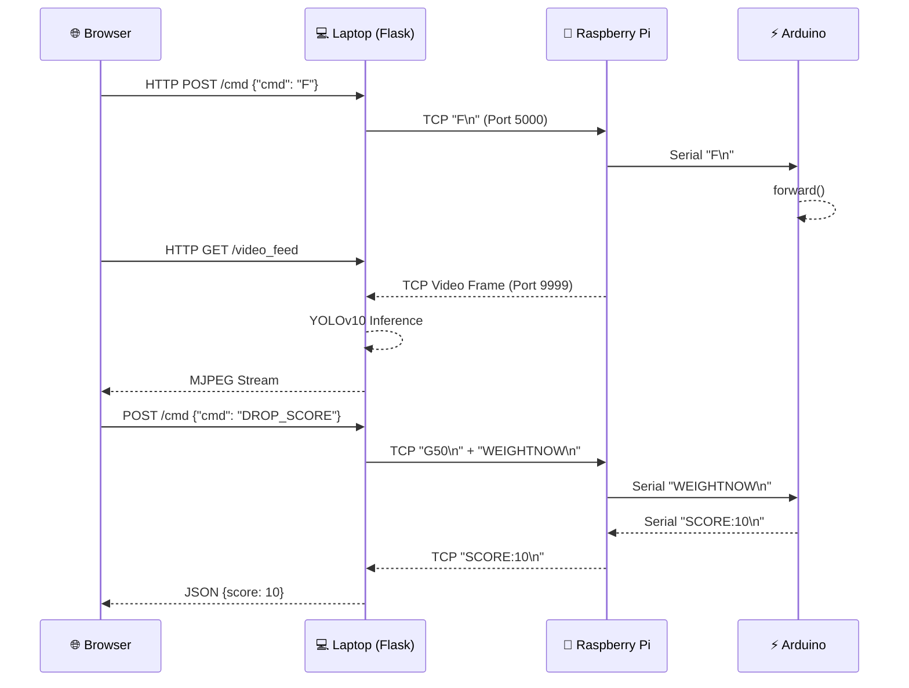
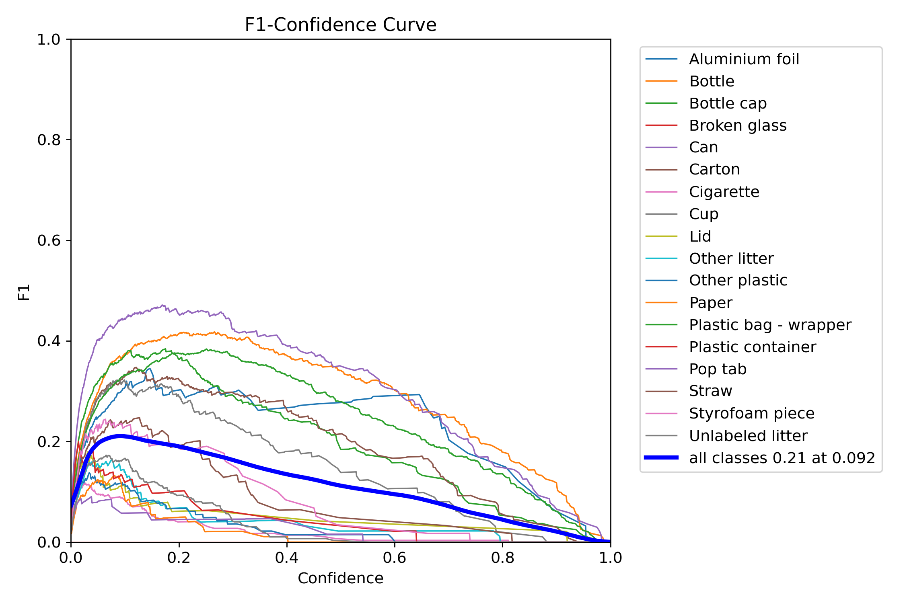
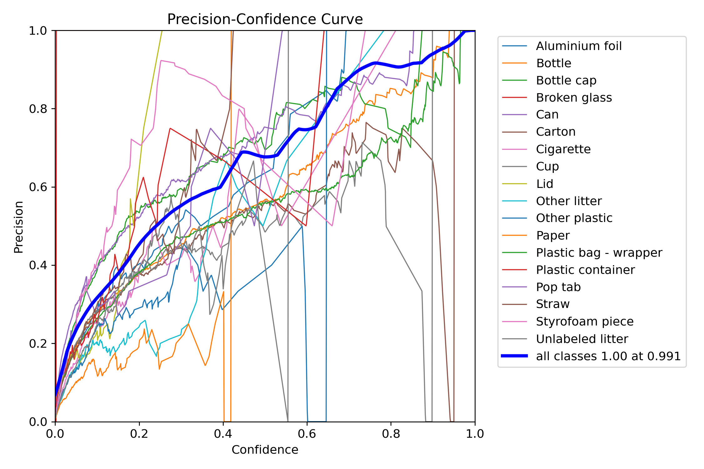
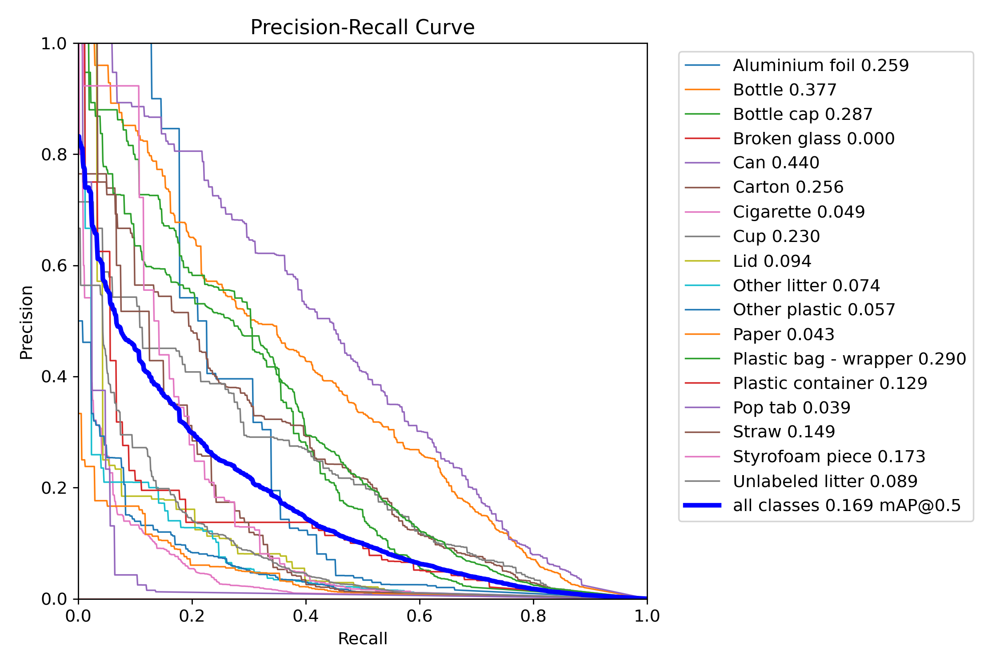
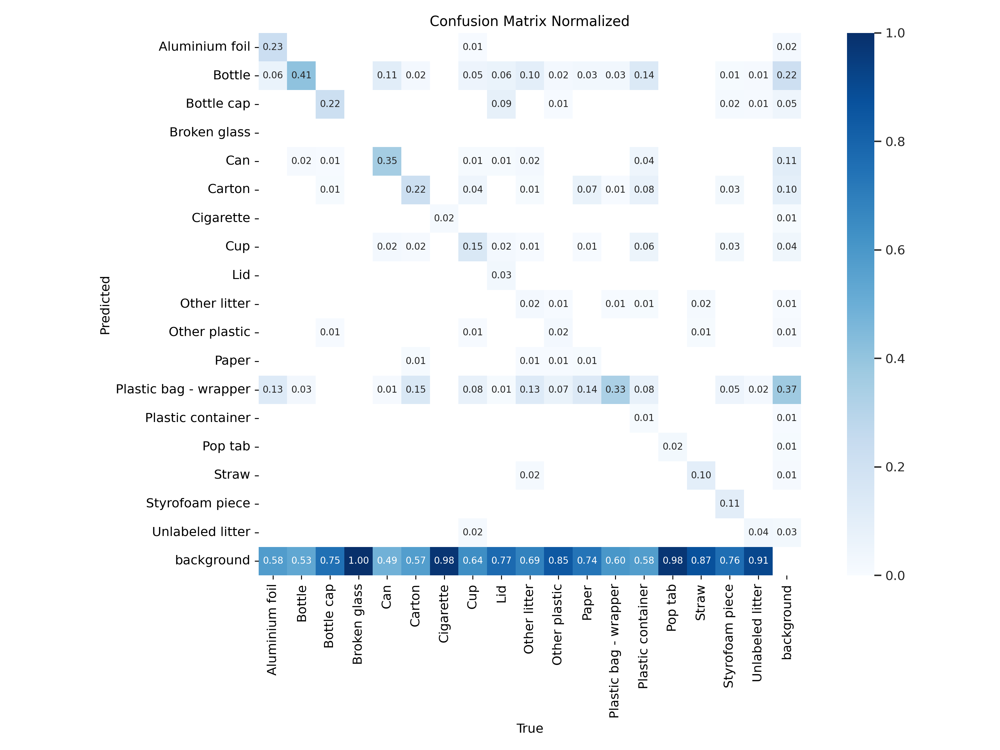

<div align="center">

# 🤖 GCBOT — Gamified Cleaning Bot

**An AI-powered autonomous trash-collecting robot with real-time web control, live video streaming, and YOLOv10 waste detection.**

[](https://python.org)
[](https://flask.palletsprojects.com)
[](https://arduino.cc)
[](https://ultralytics.com)
[](https://raspberrypi.org)
[](#-license)

</div>

---

## 📖 Table of Contents

- [Overview](#-overview)
- [Demo](#-demo)
- [Architecture](#-system-architecture)
- [Features](#-features)
- [Hardware](#-hardware)
- [Software Stack](#-software-stack)
- [AI Model — YOLOv10 Trash Detection](#-ai-model--yolov10-trash-detection)
- [Project Structure](#-project-structure)
- [Setup & Installation](#-setup--installation)
- [How to Run](#-how-to-run)
- [Control Protocol](#-control-protocol)
- [Scoring System](#-scoring-system)
- [Web Control Interface](#-web-control-interface)
- [Contributing](#-contributing)

---

## 🌟 Overview

**GCBOT** is a remotely controlled garbage-collecting robot built for competitions and real-world waste management challenges. It combines:

- 🏎️ **A 4-wheel drive chassis** controlled via a motor driver
- 🦾 **A servo-powered arm & gripper** for picking up trash
- 📷 **A live camera stream** from an onboard Raspberry Pi
- 🧠 **YOLOv10 AI** running real-time trash detection on the laptop
- ⚖️ **A load-cell scoring system** to auto-score collected trash
- 🌐 **A browser-based control panel** accessible from any device on the network

The entire system communicates over TCP sockets — the laptop runs the Flask web server and AI inference, the Raspberry Pi acts as a bridge between the laptop and the Arduino, and the Arduino directly controls all motors and servos.

---

## 🎬 Demo

### 🖥️ Web Control Interface (Desktop)

> The full-screen landscape control panel with live AI Detection feed, movement D-pad, gripper & arm controls, and the real-time score badge.


---

### 📱 Mobile Interface — Landscape Mode

> The interface automatically adapts to mobile landscape mode. All controls are touch-optimized and response is near-instant thanks to TCP_NODELAY.

| Mobile View (Portrait) | Mobile Landscape with Feed |
|:---:|:---:|
|  |  |

---

## 🏗️ System Architecture

```
┌──────────────────────────────────────────────────────────────────┐
│                   GCBOT — Gamified Cleaning Bot                  │
│                                                                  │
│  ┌────────────┐   WiFi/TCP   ┌──────────────┐   Serial/USB      │
│  │   LAPTOP   │◄────────────►│ Raspberry Pi │◄─────────────────►│
│  │            │              │              │                    │
│  │ Flask App  │              │ pi_control   │   ┌─────────────┐  │
│  │ (Port 5001)│              │ (Port 5000)  │   │   Arduino   │  │
│  │            │              │              │   │             │  │
│  │ YOLOv10    │◄── Video ───►│ Camera       │   │ Motor Driver│  │
│  │ Inference  │   (Port 9999)│ Stream Tx    │   │ Servos (x4) │  │
│  │            │              │              │   │ Load Cell   │  │
│  │ Web UI     │◄── Cmds ────►│ Serial Relay │   │ HX711       │  │
│  └────────────┘              └──────────────┘   └─────────────┘  │
│        ▲                                                          │
│        │  HTTP (Browser)                                          │
│  ┌─────┴──────┐                                                   │
│  │ Any Device │ (Phone / Tablet / PC on same network)            │
│  └────────────┘                                                   │
└──────────────────────────────────────────────────────────────────┘
```

### Communication Flow



---

## ✨ Features

| Feature | Description |
|---|---|
| 🎮 **WASD / D-pad Control** | Move forward, backward, left, right with keyboard or touch |
| 🦾 **Arm Lift Control** | Dual servo arm with animated angle ring indicator |
| 🤏 **Gripper Control** | Dual servo gripper (open/close) with visual feedback |
| 🗑️ **Drop Object** | One-tap: releases gripper → triggers weight check → auto-scores |
| 📷 **Live Camera Feed** | MJPEG stream from Pi camera at ~30 FPS |
| 🤖 **AI Detection Feed** | YOLOv10 trash overlay feed (host only) with toggle |
| ⚖️ **Auto Scoring** | HX711 load cell detects collected trash weight, score broadcasts to all clients |
| 📱 **Mobile Responsive** | Landscape-optimized with portrait rotation hint |
| ⚡ **Low Latency** | TCP_NODELAY + no blocking delays = near-zero command lag |
| 🔄 **Auto-Reconnect** | All TCP connections auto-reconnect on drop |

---

## 🔧 Hardware

### Components List

| Component | Quantity | Purpose |
|---|---|---|
| Arduino Uno | 1 | Motor & servo control, load cell reading |
| Raspberry Pi 4 | 1 | Video streaming, TCP bridge to Arduino |
| L298N Motor Driver | 1 | 4WD motor control |
| DC Gear Motors (TT Motor) | 4 | Drive wheels |
| SG90 / MG90S Servo | 4 | 2× Arm lift + 2× Gripper |
| HX711 Load Cell Amplifier | 1 | Weight sensing for scoring |
| Load Cell (1kg) | 1 | Detects collected trash weight |
| Pi Camera Module | 1 | Live video stream |
| 3S LiPo / 18650 Pack | 1 | Power supply |
| Robot Chassis (4WD) | 1 | Physical body |

### Wiring — Arduino Pin Map

```
Arduino Uno
├── Pin  2  → L298N IN1  (Left Motor A)
├── Pin  3  → L298N IN2  (Left Motor B)
├── Pin  4  → L298N IN3  (Right Motor A)
├── Pin  7  → L298N IN4  (Right Motor B)
├── Pin  8  → L298N ENA  (Left Motor PWM)
├── Pin 12  → L298N ENB  (Right Motor PWM)
├── Pin  5  → Gripper Servo A (grabA)
├── Pin  6  → Gripper Servo B (grabB) [mirrored]
├── Pin  9  → Lift Servo A (liftA)
├── Pin 10  → Lift Servo B (liftB) [mirrored]
├── Pin A0  → HX711 SCK
└── Pin A1  → HX711 DT
```

---

## 💻 Software Stack

| Layer | Technology |
|---|---|
| **Web Framework** | Flask (Python) |
| **AI Inference** | Ultralytics YOLOv10 (`best.pt`) |
| **Computer Vision** | OpenCV (`cv2`) |
| **Video Protocol** | MJPEG over HTTP (multipart) |
| **Control Protocol** | Raw TCP sockets with TCP_NODELAY |
| **Serial** | PySerial (Pi ↔ Arduino) |
| **Frontend** | Vanilla HTML/CSS/JS with glassmorphism UI |
| **Fonts** | Google Inter |
| **Microcontroller** | Arduino C++ with Servo.h + HX711.h |
| **Pi Script** | Python threading + socket server |

---

## 🧠 AI Model — YOLOv10 Trash Detection

The onboard AI model is a **custom-trained YOLOv10** fine-tuned on a multi-class garbage detection dataset. It runs locally on the **laptop CPU** in a dedicated inference thread at 416×416 resolution.

### Detected Waste Classes (18 classes)

> Aluminium foil · Bottle · Bottle cap · Broken glass · Can · Carton · Cigarette · Cup · Lid · Other litter · Other plastic · Paper · Plastic bag/wrapper · Plastic container · Pop tab · Straw · Styrofoam piece · Unlabeled litter

### Training Performance Graphs

<table>
<tr>
<td><b>Precision-Recall Curve (Train)</b></td>
<td><b>Confusion Matrix (Train)</b></td>
</tr>
<tr>
<td></td>
<td></td>
</tr>
<tr>
<td><b>F1-Confidence Curve</b></td>
<td><b>Precision Curve</b></td>
</tr>
<tr>
<td></td>
<td></td>
</tr>
</table>

### Validation Performance Graphs

<table>
<tr>
<td><b>Precision-Recall Curve (Val)</b></td>
<td><b>Confusion Matrix (Val)</b></td>
</tr>
<tr>
<td></td>
<td></td>
</tr>
</table>

### Inference Optimizations

- ✅ Frame resized to **416×416** before inference (3× speedup vs full-res)
- ✅ **Duplicate frame skipping** — hashes frame identity, skips if unchanged
- ✅ **PyTorch thread capping** — prevents CPU over-subscription
- ✅ **Confidence threshold 0.25** — filters weak detections
- ✅ **Annotated frame scaled back** to original resolution after inference

---

## 📁 Project Structure

```
GCBOT/
│
├── app.py                              # 💻 Laptop: Flask server, YOLOv10 inference, video stream
├── pi_control.py                       # 🍓 Raspberry Pi: TCP server + Serial relay to Arduino
│
├── gcbot_arduino/
│   └── gcbot_arduino.ino              # ⚡ Arduino: motors, servos, load cell, scoring
│
├── Trash_detection_Yolov10_StreamLit/
│   ├── best.pt                        # 🧠 Trained YOLOv10 model weights
│   ├── train_graphs/                  # 📊 Training performance graphs
│   │   ├── PR_curve.png
│   │   ├── F1_curve.png
│   │   ├── P_curve.png
│   │   ├── R_curve.png
│   │   └── confusion_matrix_normalized.png
│   ├── val_graphs/                    # 📊 Validation performance graphs
│   │   ├── PR_curve_val.png
│   │   ├── F1_curve_val.png
│   │   ├── P_curve_val.png
│   │   ├── R_curve_val.png
│   │   └── confusion_matrix_normalized_val.png
│   ├── train_yolov10_garbage_detection.ipynb  # 📓 Training notebook
│   └── requirements.txt
│
├── Screenshot 2026-03-26 213021.png   # 🖼️ Desktop UI screenshot
├── WhatsApp Image 2026-03-17 *.jpeg   # 🖼️ Hardware & mobile UI photos
└── README.md
```

---

## ⚙️ Setup & Installation

### Prerequisites

- Python 3.10+ on the **Laptop**
- Python 3.x on the **Raspberry Pi**
- Arduino IDE for flashing the `.ino` sketch

### 1. Laptop Setup

```bash
# Clone the repository
git clone https://github.com/your-username/gcbot.git
cd gcbot

# Create virtual environment
python -m venv .venv
.venv\Scripts\activate      # Windows
# source .venv/bin/activate # Linux/Mac

# Install dependencies
pip install flask ultralytics opencv-python numpy torch
```

### 2. Raspberry Pi Setup

```bash
# Copy pi_control.py to the Raspberry Pi
scp pi_control.py pi@kavin.local:~/

# SSH into Pi and install dependencies
ssh pi@kavin.local
pip install pyserial
```

### 3. Arduino Setup

1. Open `gcbot_arduino/gcbot_arduino.ino` in **Arduino IDE**
2. Install required libraries:
   - **Servo** (built-in)
   - **HX711** by bogde
3. Flash to your Arduino Uno

> ⚠️ **Calibrate your load cell!** Replace `2280.0` in the sketch with your actual calibration factor. Run a calibration sketch with a known weight to find the correct value.

### 4. Configuration

In `app.py`, update the Pi's hostname or IP:

```python
PI_IP        = "kavin.local"   # or use the Pi's IP e.g. "192.168.1.42"
CONTROL_PORT = 5000
VIDEO_PORT   = 9999
```

In `pi_control.py`, update the serial port if needed:

```python
ARDUINO_PORT = "/dev/ttyUSB0"   # use /dev/ttyACM0 for some Arduinos
ARDUINO_BAUD = 9600
```

---

## 🚀 How to Run

### Step 1 — Flash the Arduino

Connect the Arduino to the Raspberry Pi via USB, then flash `gcbot_arduino.ino` from your development machine.

### Step 2 — Start the Pi Bridge

```bash
# On Raspberry Pi
python3 pi_control.py
```

The Pi will:
- Open the Arduino serial port
- Start listening for laptop connections on port `5000`
- Start a video stream sender on port `9999` *(handled by the Pi camera script —  ensure your Pi camera streaming script is also running)*

### Step 3 — Start the Laptop Server

```bash
# On the Laptop (must be on same WiFi as the Pi)
python app.py
```

### Step 4 — Open the Web UI

Navigate to:

```
http://localhost:5001          # on the laptop (AI Detection feed)
http://<laptop-ip>:5001        # on any phone/tablet on the same WiFi
```

---

## 📡 Control Protocol

Commands are sent as **newline-terminated ASCII strings** over TCP:

| Command | Description |
|---|---|
| `F` | Move forward |
| `B` | Move backward |
| `L` | Turn left |
| `R` | Turn right |
| `S` | Stop all motors |
| `U<angle>` | Set arm lift angle (0–180°), e.g. `U90` |
| `G<angle>` | Set gripper angle (0–180°), e.g. `G120` |
| `WEIGHTNOW` | Trigger a weight check on the load cell |

### HTTP API (Flask)

| Endpoint | Method | Description |
|---|---|---|
| `/` | GET | Serve the control UI |
| `/cmd` | POST | Send a command to the robot |
| `/video_feed` | GET | Raw MJPEG camera stream |
| `/video_feed_detected` | GET | YOLOv10 annotated MJPEG stream |
| `/score` | GET | Get current score as JSON |

**Example cURL:**

```bash
curl -X POST http://localhost:5001/cmd \
     -H "Content-Type: application/json" \
     -d '{"cmd": "F"}'
```

---

## 🏆 Scoring System

The scoring is fully **Arduino-side computed** and triggered only by explicit commands (not automatic polling):

```
1. User presses 🗑️ DROP OBJECT button in the browser
2. Flask sends: G50 (open gripper to 50°)
3. After 800ms delay: Flask sends WEIGHTNOW
4. Arduino reads HX711 load cell (avg 3 readings)
5. if (current_weight - last_weight) > 20g:
       score += 10
       Arduino sends "SCORE:10\n"
6. Pi forwards SCORE:10 to all connected laptops
7. Flask broadcasts score via /score endpoint
8. Browser updates the score badge with animation
```

> The 3-second cooldown between scores prevents accidental double-counting due to weight oscillation.

---

## 🌐 Web Control Interface

The control UI is a **single-page, glassmorphism-styled dashboard** embedded in Flask (`app.py`). No external CSS framework is used.

### UI Features

- 🎮 **D-pad** for movement (touch + WASD keyboard)
- 🔵 **SVG ring indicator** for real-time arm/gripper angle display
- 🟢 **Score badge** (top-right, always visible) with scale-bounce animation on score update
- 📡 **Feed toggle** — switch between `Raw` and `AI Detection` video feed
- 🟢 **Status dot** with pulse animation indicating live connection
- ↻ **Portrait warning** — prompts rotation on mobile portrait mode
- ✚ **Crosshair overlay** on the video feed for targeting

---

## 🤝 Contributing

Contributions, issues, and feature requests are welcome!

1. Fork the repository
2. Create your feature branch (`git checkout -b feature/AmazingFeature`)
3. Commit your changes (`git commit -m 'Add some AmazingFeature'`)
4. Push to the branch (`git push origin feature/AmazingFeature`)
5. Open a Pull Request

---

## 📄 License

```
Copyright © 2026 Kavin and Team. All Rights Reserved.

This project and all its source code, assets, trained models, and documentation
are the intellectual property of Kavin and Team. No part of this project may be
reproduced, distributed, modified, or used in any form without the express written
permission of the owners.

For licensing inquiries or collaboration, please open an issue or contact via GitHub.
```

---

<div align="center">

**Built with ❤️ for making the world cleaner, one piece of trash at a time 🌍♻️**

*GCBOT — Gamified Cleaning Bot*

</div>
